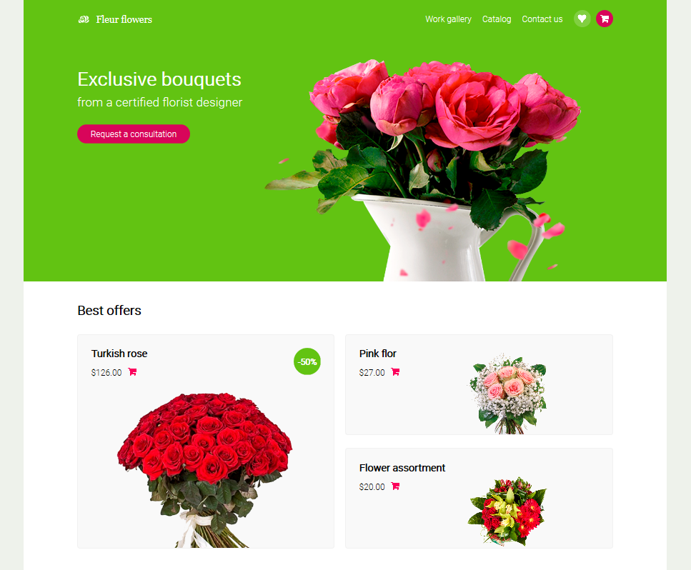

# Flowershop

> This is the final project of the HTML and CSS course of the Microverse program, its objective is to put into practice all the knowledge acquired during the course: CSS grid, flexbox, positioning, typography, layots, design, good practices, and more.

You can find the basis of the project [here](https://www.behance.net/gallery/69329213/Flower-e-shop), a design created by [Michael D on Dribbble](https://www.behance.net/altezzik).

## Built With

- HTML
- CSS

## Live Demo

[Live Demo Link](https://meme-es.github.io/flowershop/)

## Authors

👤 **Manuel**

- Github: [@meme-es](https://github.com/meme-es)
- Twitter: [@meme_es](https://twitter.com/meme_es)
- Linkedin: [linkedin](https://www.linkedin.com/in/manuel-elias-b289a638/)

## 🤝 Contributing

Contributions, issues and feature requests are welcome!

Feel free to check the [issues page](https://github.com/meme-es/flowershop/issues).

## Show your support

Give a ⭐️ if you like this project!

## 📝 License

This project is free licensed.